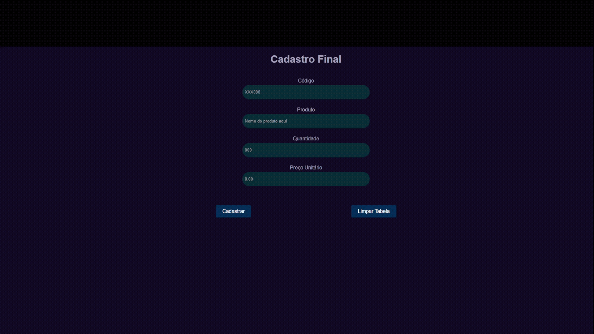

<h1> Cadastro de Produtos </h1>

<h2><strong>Sobre o projeto </strong></h2>

 Projeto desenvolvido como atividade final no módulo de Lógica de Programação utilizando Javascript, durante o programa Santander Coders 2023.1 oferecido pela Ada Tech em parceria com o Banco Santander. 

 A finalidade desse projeto é receber dados de um produto como: código do produto, nome do produto, quantidade e valor unitário. A partir da entrada desses dados é feito um processamento para que essas informações sejam mostradas em uma tabela abaixo do formulário de entrada de dados. 

 Como adição, implementei também um botão que limpa a tabela. 

  

<h3 align="center"> Tecnologias Utilizadas 🛠 </h3>

<b> HTML | CSS | JavaScript | Git | GitHub
</b>

### <h3 align="center"> [Acesse meu perfil no Linkedin aqui](https://www.linkedin.com/in/tthayza-oliveira/) </h3>
